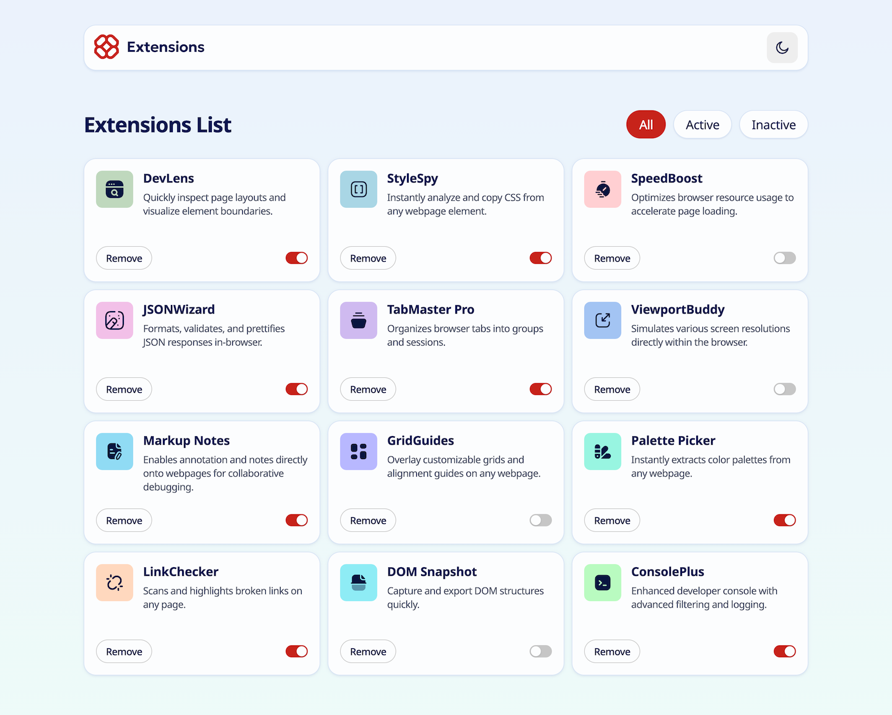

# Frontend Mentor - Browser extensions manager UI solution

This is a solution to the [Browser extensions manager UI challenge on Frontend Mentor](https://www.frontendmentor.io/challenges/browser-extension-manager-ui-yNZnOfsMAp). Frontend Mentor challenges help you improve your coding skills by building realistic projects.

## Table of contents

- [Overview](#overview)
  - [The challenge](#the-challenge)
  - [Screenshot](#screenshot)
  - [Links](#links)
- [My process](#my-process)
  - [Built with](#built-with)
  - [What I learned](#what-i-learned)
    - [Project structure](#project-structure)
    - [State management with Signals](#state-management-with-signals)
    - [Animations](#animations)
    - [Extra features](#extra-features)
  - [Useful resources](#useful-resources)
- [Author](#author)

## Overview

### The challenge

Users should be able to:

- Toggle extensions between active and inactive states
- Filter active and inactive extensions
- Remove extensions from the list
- Select their color theme
- View the optimal layout for the interface depending on their device's screen size
- See hover and focus states for all interactive elements on the page

### Screenshot




### Links

- Solution URL: [GitHub Repository](https://github.com/FerdinandoGeografo/browser-extensions-manager-ui)
- Live Site URL: [Browser Extension Manager UI](https://extensions-manager-ui-fg.netlify.app/)

## My process

### Built with

- Semantic HTML5 markup
- CSS custom properties
- Desktop-first workflow
- [TypeScript](https://www.typescriptlang.org/) - JS superset
- [Angular (v22)](https://angular.dev/) - Frontend Typescript Framework
- [Angular Material & CDK](https://material.angular.dev/) - UI Components libraries

### What I learned

For this challenge I tried out the newest major version 22 of `Angular`, whic has made the developer experience noticeably leaner and more concise by drastically reducing boilerplate code.

#### Project structure

I followed my usual folder organization: each top-level folder under `app/` represents a **feature**, implemented as a routed component declared in `app.routes`. While this specific challenge only required a single feature (`extensions`), I still kept a `shared` folder to host functionality that could be reused across other features if the app were to grow.

Each feature folder contains its own routed "smart" component and follows the same internal convention:

- `data-access` — business logic and state management, exposed through one or more services (stores).
- `ui` — "dumb", purely presentational components that receive data via inputs and communicate back via outputs.
- `models` — type and interface definitions for that feature.

#### State management with Signals

I did get real hands-on practice applying a clean, consistent structure that keeps both smart and dumb components thin on business logic.
Instead, logic and state live in dedicated store services, built entirely with `signal`, `computed`, and `effect` — no NgRx or other external state library was needed for a feature of this size.

One useful lesson that came out while developing this: **`effect` should be the last resort, not the default tool**. I reserved it strictly for genuine side effects, and let `computed` handle every purely derived value.

A concrete example of this is how extension filtering works. The **URL query param is the single source of truth** for the active filter — this keeps it bookmarkable and shareable, and survives a page refresh for free.
The store itself stays routing-agnostic: it just exposes a plain `filter` signal and a `setFilter()` method, and derives `filteredExtensions` from it with a `computed`:

```ts
...
filter = computed(() => this.#state().filter);

filteredExtensions = computed(() =>
  this.extensions().filter(
    (e) => !this.filter() || e.isActive === this.filter()?.isActive,
  ),
);

setFilter(filter: Filter) {
  this.#state.update((s) => ({ ...s, filter }));
}
```

The routed `Extensions` component is the only piece that knows about the URL. Thanks to `withComponentInputBinding()`, the `isActive` query param is bound directly as a component input, and an `effect` translates it into a call to `setFilter()` — falling back to a URL correction if the param is malformed:

```ts
readonly isActive = input<string>();

constructor() {
  effect(() => {
    const isActive = this.isActive();
    if (isActive === undefined) return this.extStore.setFilter(null);
    if (isActive === 'true' || isActive === 'false') {
      return this.extStore.setFilter({ isActive: isActive === 'true' });
    }
    this.#router.navigate([], { relativeTo: this.#route, replaceUrl: true });
  });
}
```

It might look like the filter is duplicated between the URL and the store, but it isn't redundant: the store needs its own signal to derive `filteredExtensions` internally, while staying decoupled from `Router`/`ActivatedRoute` — it doesn't care _how_ the filter is set, only that it's set.
That decision is left entirely to whoever consumes the store, which in this case is the routed component reading the URL.

#### Animations

Angular's animation story has changed significantly in recent versions, moving away from the dedicated `@angular/animations` package in favor of plain CSS/SCSS, paired with the new `animate.enter` / `animate.leave` template API.
I used this to add staggered enter animations for the filter buttons and the extension cards, plus a leave animation when removing an extension.

#### Extra features

To make the challenge a bit more interesting, I added a couple of things that weren't strictly required: a confirmation modal before deleting an extension, and the animations described above.

Given the scope of the challenge, the data is purely mock data read from the provided static JSON file — no real backend involved.

### Useful resources

- [CSS Animations](https://codepen.io/nelledejones/pen/gOOPWrK)
  Provides nice examples of keyframes and animations to grasp quickly.

## Author

- Frontend Mentor - [@FerdinandoGeografo](https://www.frontendmentor.io/profile/FerdinandoGeografo)
- LinkedIn - [@FerdinandoGeografo](https://www.linkedin.com/in/ferdinandogeografo/)
- GitHub - [@FerdinandoGeografo](https://github.com/FerdinandoGeografo/)
